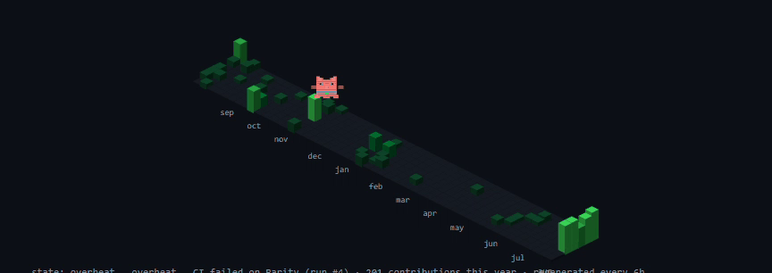

https://github.com/user-attachments/assets/4383d073-171e-41e7-a5ca-651fe3a2f6e9

# github-pet 🐱

A pixel cat that lives on your GitHub profile and reacts to your **real GitHub
activity**. Zero dependencies, no JavaScript, no hosting - a deterministic
state machine rendered to animated SVGs by a GitHub Action in *your* repo.




## Quick start (5 minutes)

**1.** Add this workflow to your profile repo (`your-username/your-username`)
as `.github/workflows/pet.yml`:

```yaml
name: My github-pet
on:
  schedule:
    - cron: '23 */6 * * *'   # every 6h - pick your own minute
  workflow_dispatch:

permissions:
  contents: write

jobs:
  pet:
    runs-on: ubuntu-latest
    steps:
      - uses: actions/checkout@v4
      - uses: prsdx/github-pet@v1
        with:
          username: your-username        # change me
          timezone-offset-minutes: "330" # your UTC offset in minutes
```

**2.** Embed the cat in your `README.md`:

```html
<picture>
  <source media="(prefers-color-scheme: dark)" srcset="https://raw.githubusercontent.com/your-username/your-username/main/dist/pet.svg">
  <source media="(prefers-color-scheme: light)" srcset="https://raw.githubusercontent.com/your-username/your-username/main/dist/pet-light.svg">
  
</picture>
```

**3.** Run it once manually (Actions → *My github-pet* → Run workflow), or
wait for the schedule. That's it - it keeps itself alive forever.

## What you get

| File | What it is |
|---|---|
| `pet.svg` / `pet-light.svg` | Banner scene: the cat eats, bats its yarn, sleeps in its box - greets visitors by time of day and points them around your profile |
| `isocat.svg` / `isocat-light.svg` | Your full-year contributions as an **isometric city**, cat hopping along each week's busiest day |
| `graph.svg` / `graph-light.svg` | The classic flat contribution graph with the hopping kitty |
| `langs.svg` / `langs-light.svg` | Language share chart from real repo bytes |

## The cat is honest

Every state maps to real data (first match wins):

| State | Rule | Visual |
|---|---|---|
| 🔥 overheat | a watched repo's latest CI run failed (24h window) | cat turns red, steams |
| zoomies | PR merged ≤24h, or ≥3 pushes today | sprints with motion lines |
| sleeping | 00:00–06:00 your local time, nothing pushed ≤6h | curled up, floating Zzz |
| content | pushed ≤24h | daily routine + hearts |
| hungry | no pushes for 24–96h | camps at the empty bowl |
| grumpy | no pushes for >96h | sulks in the cardboard box |

If the API is unreachable the cat plays it cool instead of erroring your
profile: flat slabs, an honest caption, everything still renders.

## Configuration

| Input | Default | What it does |
|---|---|---|
| `username` | repo owner | Whose activity to watch |
| `token` | `GITHUB_TOKEN` | Used for the contribution calendar (GraphQL). The default token is enough |
| `timezone-offset-minutes` | `0` | Your UTC offset in minutes - drives sleeping + greeting |
| `watched-repos` | *(empty)* | Comma-separated repos for the overheat state, e.g. `"api,web"` |
| `display-name` | *(auto)* | First name in the greeting (auto-detected from your profile if empty) |
| `contact-line` | *(empty)* | Third guide bubble, e.g. your email. Empty skips it |
| `output-dir` | `dist` | Where the SVGs are written |
| `attribution` | `true` | Appends `github-pet by prsdx` to the caption strip 💙 |

## FAQ

- **Why a token for the calendar?** GitHub's contribution calendar is only
  exposed via GraphQL, which requires auth. Everything else works tokenless.
- **The image on my profile is stale.** GitHub proxies README images through
  its Camo cache - give it a few minutes, or hard-refresh (`Ctrl+F5`).
- **Scheduled run didn't fire on time?** GitHub cron can lag under load. Use
  *Run workflow* for instant regeneration. (Repos never go inactive here -
  the workflow commits every 6h, so GitHub never pauses the schedule.)
- **Can I self-host instead of using the Action?** Yes: fork/clone and run
  `node generate.ts` (Node 24+) or `bun generate.ts` - see
  [CONTRIBUTING.md](CONTRIBUTING.md) for the env-var knobs.

## Feedback

- 🐱 **Show & tell / ideas:** [Discussions](../../discussions) - post your pet
- 🐛 **Bugs:** [Issues](../../issues) - templates included, logs appreciated
- If the cat made you smile, a ⭐ tells other people it exists.

---

Zero-dependency TypeScript. Built by hand - pixel grids, state machine and
all. [Live on the author's profile](https://github.com/prsdx) · MIT licensed.
